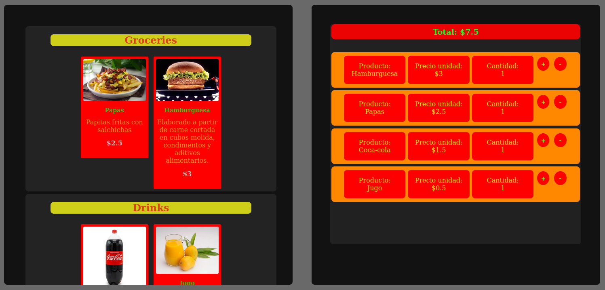

# <h1 align="center" style="color: yellow"> Online   </h1>

## <h1 align="center" style="color: green"> Overall Design </h1>

# 

## <h1 align="center" style="color: green"> you can register multiple products </h1>

# 

## <h1 align="center" style="color: green"> more functionalities </h1>

**<li> Increase the quantity of the same product </li>**

**<li> Reduce the amount of the same product until it is eliminated </li>**

**<li> The total works correctly together with the amounts of the product that exist and also with the added products </li>**

**<li> In conclusion, it works just like a cash register </li>**

